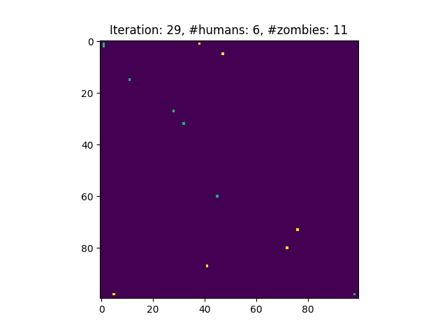

# Zombie Simulation Project
#### Video Demo:  <https://www.youtube.com/watch?v=_MYrfBENJXk>
#### Description:

In this project I'm going to develop a Python simulation of zombie apocalypse. There are characters of two classes - humans and zombies - who fight each other in order to win the battle. When a human wins a fight he kills a zombie. Otherwise, the human gets infected and turns into a zombie. Each of the zombies follows a simple strategy based on resultant proximity of humans around, combined with their individual ability to attract zombies. Humans use more sophisticated strategy which consists of two main components: they want to get closer to their strong companions and stay away from the weak ones, and they want to avoid strong zombies and follow the weak ones.

[**General rules**](images/general_rules.pdf)

### Configuration files and heroes classes

Each configuration .json file in `conf` folder contains the dictionary with the following key-value pairs for both humans and zombies:

- `initial_number` (int) - unutual number of humans/zombies in the simulation
- `x` (list) - initial positions on x-axis picked from normal distribution
- `y` (list) - initial positions on x-axis picked from normal distribution
- `velocity` (list) - mean and std for velocity
- `power` (list) - mean and std for strength/power

There is `classes` subfolder containig the definitions of human/zombie object defined as separate classes with the following attributes:

- `x`
- `y`
- `velocity`
- `power`
- `n_killed` / `n_infected`

File `common.py` is the base class used by `Human` and `Zombie` via inheritance. This class contains the `move()` method with arguments `delta_x` and `delta_y` by which the heroes positions should be change in a single time-step of the simulation. Additionally, the inheriting classes have separate `choose_new_position()` methods which compute `delta_x` and `delta_y` used by `move()`.

### Simple moving algorithm

1. Extract all vectors pointing from the current hero position to all the opponents and normalize them.
2. Multiply each vector by weight proportional to relative strength defined by `n_killed` / `n_infected`
3. Sum all vectors pointing to enemies for each particular hero, normalize and multiply by `velocity`

[**Zombie strategy**](images/zombie-strategy.pdf) (for simplicity the human strategy follows the zombie one now)

### Data flow structure of the simulation

Implementation of `initialize()` function reads configuration files for both humans and zombies and then creates the list of instances of `Human` and `Zombie`. Then in `main.py` file which is the main file to run the simulation, we create the initial 2D map of figth area and call `initialize()` function to create the list of heroes. Next, we run the `run_simulation()` function which takes humans, zombies and 2D map and run the main hardcode of the simulation itself. For plotting purpose we use `visualize_simulation()` function which takes humans, zombies, time and 2D map and plot the current position of all the heroes. To slow down the animation a little, we use `plt.pause()` method. The whole simulation ends when either number of humans or zombies drops down to zero or the number of iterations increases above 1000 (in such a situation typically the situation of the map is so-called 'steady state'). In each iteration we calculate the future positions of all heroes and if the distance to the opponent is smaller than 3, the fight begins!

### Fights between humans and zombies

implementation of `find_all_pairs_about_to_clash()` function finds all human-zombie pairs suppose to fight in the current time instance. Remember that this happen when the relative distance between them is shorter than 3. It uses `carry_out_clashes()` function which stores the dictionaries of winners and losers in each round of simulation along with the current results (notice that single hero can fight more than once when surrounded by enemies!). The result of each fight depends on higher `(power + experience) / n_rivals` parameter. In zombie looses the fight, he dies automatically. On the other hand, if the zombie is a winner, the human opponent is being infected and starts as a new zombie from the next simulation round. Each winnner gets experience points which helps him in the next fight.